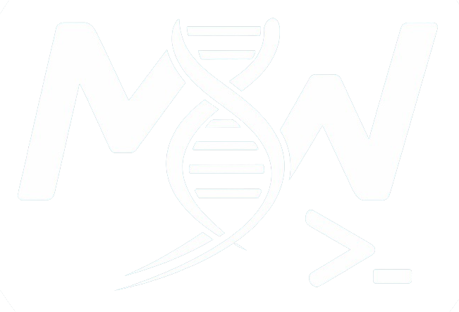

# MwInSilico

Bioinformática, do dado bruto ao conhecimento biológico

Olá! Sou **Márcio**, pesquisador de bioinformática. Este espaço reúne tutoriais, scripts e postagens sobre análise de dados, genômica, transcriptômica e reprodutibilidade computacional — o material que eu mesmo uso (e queria ter encontrado pronto) no dia a dia da pesquisa.

[Conheça o autor :octicons-arrow-right-24:](sobre.md){ .md-button .md-button--primary }
[Ver todas as tags :fontawesome-solid-tags:](tags.md){ .md-button }

---

## 🚀 Destaques

:material-dna:

Pipeline de RNA-Seq

Do GEO aos genes diferencialmente expressos: download, QC, trimming, STAR/Salmon, DESeq2 e enriquecimento funcional — rodando em container.

[:octicons-arrow-right-24: Ver tutorial](bioinfo/transcriptoma/rnaseq.md){ .mw-card-link }

:material-database-search:

Exploração do TCGA/GDC

Como navegar e baixar dados de câncer do The Cancer Genome Atlas para suas próprias análises.

[:octicons-arrow-right-24: Ver tutorial](bioinfo/bancos/exploracao_tcga.md){ .mw-card-link }

:material-cube-outline:

Containers com Apptainer

Da teoria (o que é um container, <code>.def</code>, sandbox, <code>.sif</code>) até a construção do ambiente completo de um pipeline de bioinformática.

[:octicons-arrow-right-24: Ver tutorial](singularity_tutorial.md){ .mw-card-link }

:material-post-outline:

Postagens do blog

Textos mais livres sobre biologia molecular e bioinformática — Dogma Central e a história do sequenciamento de DNA.

[:octicons-arrow-right-24: Ler postagens](post1_dogma_central.md){ .mw-card-link }

:material-dna:

Sequenciamento de DNA

Da descoberta em 1977 até PacBio e Nanopore: como aprendemos a ler o DNA, e por que isso ficou 500 mil vezes mais barato.

[:octicons-arrow-right-24: Ler postagem](post2_sequenciamento.md){ .mw-card-link }

---

## 📌 O que você vai encontrar por aqui

*   **Tutoriais de ferramentas** — guias passo a passo para Apptainer/Singularity, MkDocs, e outras ferramentas do dia a dia.
*   **Scripts de bioinformática** — pipelines comentados linha a linha para análise de dados biológicos.
*   **Reprodutibilidade** — containers e boas práticas para que suas análises rodem igual em qualquer máquina.
*   **Postagens** — textos sobre os conceitos por trás das análises.

Perdido? Todo o conteúdo do site também está organizado por [**tags**](tags.md) — clique em uma tag em qualquer página para ver tudo relacionado a ela.
