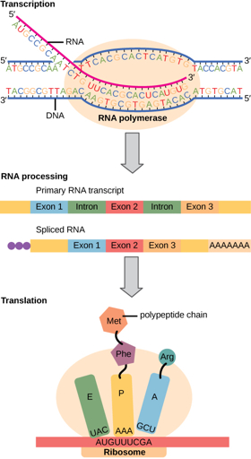
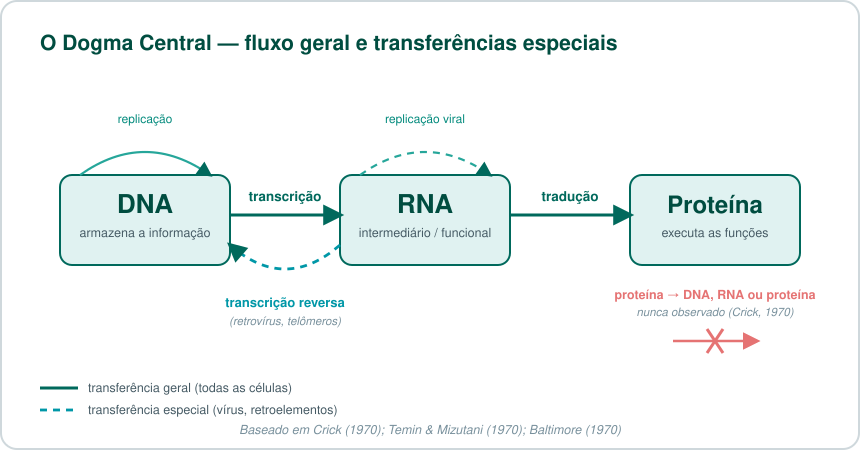
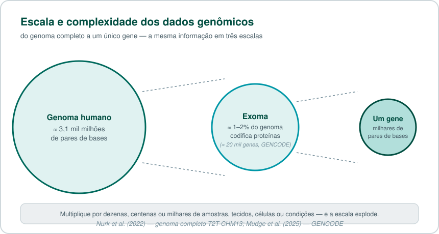
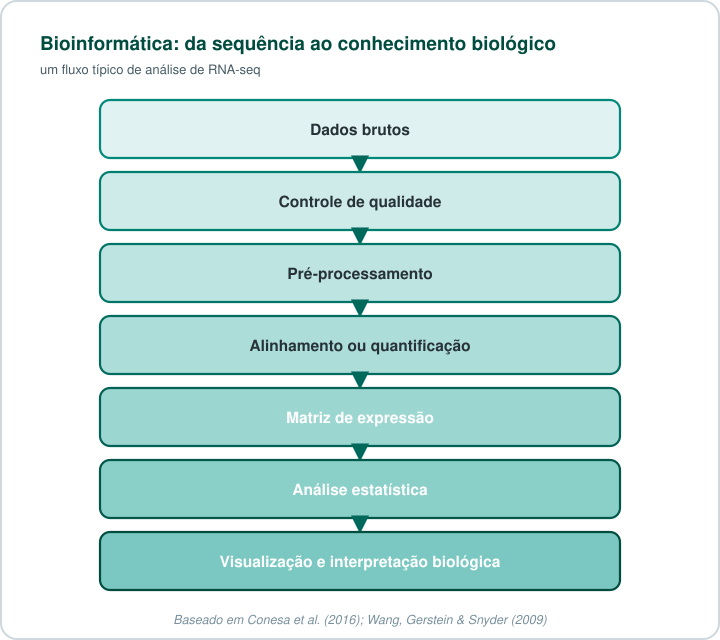
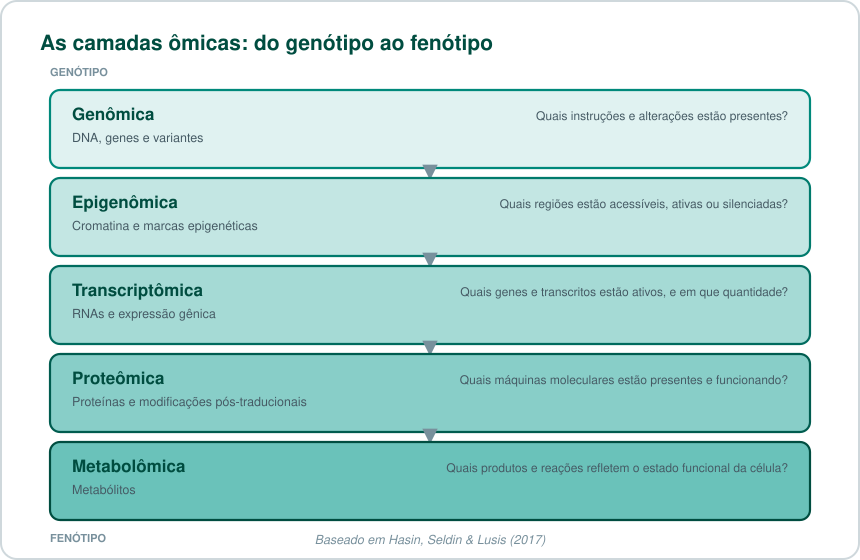
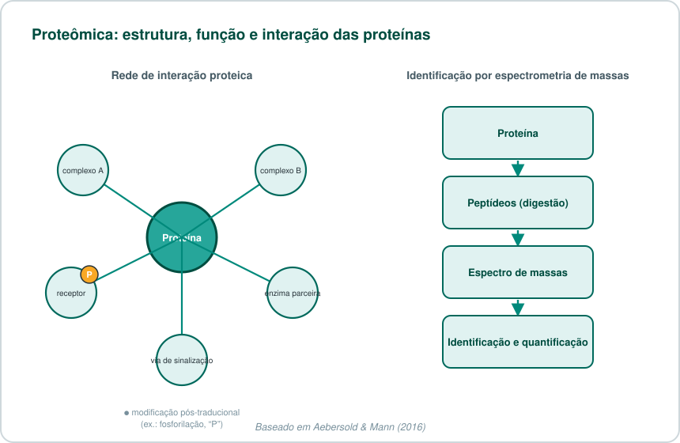
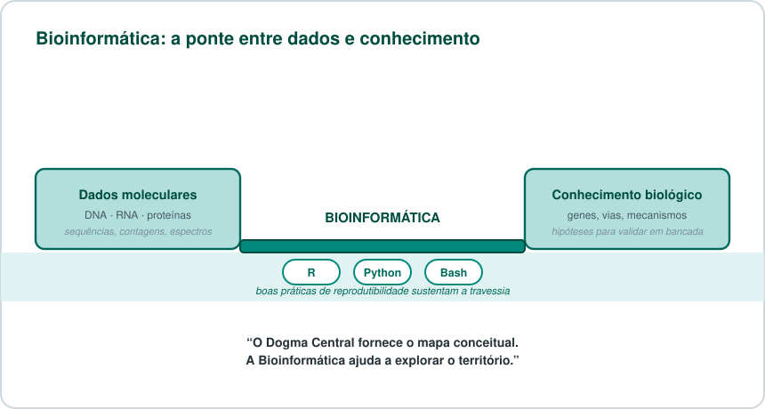

# 🧬 O Dogma Central da Biologia evoluiu — e a Bioinformática ajuda a acompanhá-lo

> **Do DNA ao fenótipo: como a Bioinformática transforma dados moleculares em conhecimento biológico.**

!!! tip "Para quem tem pressa"
    O **Dogma Central** descreve como a informação genética flui: **DNA → RNA → proteína**. Desde 1970 sabemos que existem "transferências especiais" (como a transcrição reversa), e hoje sabemos que grande parte do RNA transcrito nunca vira proteína — ele regula genes diretamente. A **Bioinformática** é a disciplina que transforma essa avalanche de dados moleculares em conhecimento biológico interpretável.

## Sumário

1. [O fluxo da informação genética](#o-fluxo-da-informacao-genetica)
2. [Um modelo que se expandiu](#um-modelo-que-se-expandiu)
3. [RNA que não vira proteína](#rna-que-nao-vira-proteina)
4. [O desafio dos dados biológicos](#o-desafio-dos-dados-biologicos)
5. [A Bioinformática como ponte](#a-bioinformatica-como-ponte)
6. [O mapa das ciências ômicas](#o-mapa-das-ciencias-omicas)
7. [Anotação e interpretação](#anotacao-e-interpretacao)
8. [Do dado ao significado biológico](#do-dado-ao-significado-biologico)
9. [Teste seus conhecimentos](#teste-seus-conhecimentos)
10. [Referências](#referencias)

---

## O fluxo da informação genética

O fluxo clássico da informação genética — **DNA → RNA → proteína** — continua sendo uma das ideias mais importantes da biologia molecular. Porém, hoje sabemos que ele é apenas uma parte de uma rede muito mais ampla, dinâmica e regulada[^1].

Em 1958, Francis Crick propôs o conceito conhecido como **Dogma Central da Biologia Molecular**. Em sua forma didática mais conhecida, ele descreve como a informação genética pode ser expressa:

```text
DNA ──transcrição──> RNA ──tradução──> proteína
```

- O **DNA** armazena a informação genética.
- O **RNA** atua como intermediário ou como molécula funcional.
- As **proteínas** realizam grande parte das funções estruturais, catalíticas e regulatórias da célula.

<center markdown="1">

</center>

Crick posteriormente esclareceu que o dogma se refere à transferência de **informação sequencial**, resíduo por resíduo. Ele não determina que todo processo celular siga exclusivamente uma linha reta entre DNA, RNA e proteína; seu princípio fundamental é que a informação não é transferida de proteínas para ácidos nucleicos ou para outras proteínas[^2].

!!! info "Um dogma mal compreendido desde o início"
    O próprio Crick escreveu o artigo de 1970 para *corrigir* interpretações equivocadas do seu conceito original de 1958 — inclusive a leitura simplista "DNA faz RNA, que faz proteína", popularizada por James Watson em seu livro-texto de 1965. O nome "dogma" foi, segundo o próprio Crick reconheceu depois, uma escolha de palavra infeliz: não se trata de um artigo de fé, mas de uma hipótese sobre o sentido em que a informação sequencial pode fluir.

---

## Um modelo que se expandiu

A biologia molecular revelou que o fluxo de informação é mais rico do que a simplificação "DNA faz RNA, que faz proteína". A descoberta da **transcriptase reversa**, em 1970, demonstrou que moléculas de RNA também podem servir de molde para a síntese de DNA:

```text
RNA ──transcrição reversa──> DNA
```

Essa enzima foi descrita de forma independente e quase simultânea por dois grupos: Howard Temin e Satoshi Mizutani, estudando o vírus do sarcoma de Rous, e David Baltimore, estudando outros vírus de RNA tumorais[^3][^4]. A descoberta foi tão significativa para a biologia molecular que, em 1975, Temin e Baltimore dividiram o Prêmio Nobel de Fisiologia ou Medicina com Renato Dulbecco.

Esse processo ocorre em retrovírus (incluindo o HIV) e também está relacionado a mecanismos celulares, como a manutenção dos telômeros pela telomerase. A transcrição reversa não "quebra" o Dogma Central: ela corresponde a uma transferência de informação que o próprio Crick já classificava como "especial" — possível, porém restrita a contextos específicos, e não observada como regra geral entre todas as células[^2].



??? question "O Dogma Central foi 'derrubado' pela transcrição reversa?"
    Não. Essa é uma confusão comum, e o próprio Crick já respondia a ela em 1970. O Dogma Central nunca afirmou que só existe a via DNA→RNA→proteína — ele afirma algo mais restrito e mais forte: que a informação **nunca** flui de volta de uma proteína para um ácido nucleico. A transcrição reversa (RNA→DNA) é uma transferência entre ácidos nucleicos, algo que o modelo sempre considerou possível como "transferência especial" — restrita a alguns contextos biológicos (retrovírus, retroelementos, telômeros), em vez de ser uma regra universal presente em todas as células.

Mais recentemente, o campo da edição de genoma guiada por RNA — como os sistemas CRISPR e proteínas de fusão com dCas9 — mostrou que RNAs-guia podem direcionar maquinário proteico a sequências específicas de DNA para editar não apenas a sequência, mas também marcas epigenéticas, ampliando ainda mais o repertório de interações entre as três classes de moléculas[^5].

---

## RNA que não vira proteína

Outro avanço foi a compreensão de que a maior parte do RNA transcrito no genoma humano nunca é traduzida em proteína. Longe de ser "lixo genômico", esses RNAs participam diretamente da regulação da expressão gênica e de processos celulares fundamentais[^6].

??? info "Glossário rápido: tipos de RNA não codificante"
    - **miRNA** (microRNA): pequenos RNAs (~22 nt) que reprimem a tradução ou promovem a degradação de RNAs mensageiros-alvo[^7].
    - **siRNA** (small interfering RNA): associados ao silenciamento gênico pós-transcricional, via a mesma maquinaria de RNAi que processa miRNAs.
    - **lncRNA** (long non-coding RNA): transcritos com mais de 200 nucleotídeos que podem atuar como guias, suportes estruturais ou reguladores da cromatina.
    - **snRNA** e **snoRNA**: RNAs nucleares e nucleolares pequenos, envolvidos no processamento (*splicing*) e na maturação de outros RNAs.
    - **circRNA**: moléculas de RNA circulares, resultantes de *splicing* atípico, com papéis regulatórios ainda em investigação ativa.
    - **rRNA** e **tRNA**: os RNAs "clássicos" e indispensáveis da maquinaria de síntese proteica — o ribossomo e os adaptadores de aminoácidos.

Além disso, RNAs podem interagir diretamente com a cromatina e influenciar estados epigenéticos — silenciando ou ativando regiões inteiras do genoma sem alterar a sequência de DNA. Sistemas como CRISPR exemplificam como RNAs-guia podem direcionar proteínas a sequências específicas de DNA, inclusive para fins terapêuticos e de engenharia genômica[^5].

---

## O desafio dos dados biológicos

A expansão das tecnologias de sequenciamento trouxe uma nova dimensão ao estudo da biologia: a escala dos dados.

O genoma humano completo — incluindo as regiões repetitivas e heterocromáticas que só foram totalmente resolvidas em 2022 pelo consórcio Telomere-to-Telomere (T2T) — tem cerca de **3,1 mil milhões de pares de bases**[^8]. Ao analisarmos múltiplos indivíduos, tecidos, condições experimentais ou células individuais, esse volume cresce rapidamente — e a sequência por si só ainda não responde às perguntas biológicas.



A grande questão deixa de ser apenas "qual é a sequência?" e passa a incluir perguntas como:

- Quais genes estão presentes no genoma?
- Quais genes estão ativos em uma condição específica?
- Quais transcritos e isoformas são produzidos?
- Como a expressão gênica varia entre tecidos, células, pacientes ou tratamentos?
- Quais variantes podem influenciar a expressão ou a função de um gene?
- Quais vias biológicas estão alteradas em uma doença?

---

## A Bioinformática como ponte

É aqui que a **Bioinformática** se torna indispensável. Ela integra biologia, estatística, matemática e programação para transformar dados moleculares de alta dimensão em resultados interpretáveis.

Uma análise típica de dados de RNA-seq, por exemplo, pode seguir o fluxo abaixo:



Com ferramentas computacionais, é possível realizar controle de qualidade, alinhamento, quantificação, normalização, análise de expressão diferencial, análise de isoformas, redução de dimensionalidade, agrupamento, enriquecimento funcional, análise de vias e integração multiômica[^9].

Linguagens como **R**, **Python** e **Bash**, associadas a boas práticas de reprodutibilidade — controle de versão, ambientes computacionais isolados (como containers Apptainer/Docker) e documentação clara de cada etapa —, permitem executar análises que seriam impossíveis de conduzir manualmente em planilhas ou com caderno e caneta.

!!! tip "Quer colocar a mão na massa?"
    Publicamos um [tutorial completo de RNA-seq](bioinfo/transcriptoma/rnaseq.md) cobrindo do download no GEO até a lista final de genes diferencialmente expressos e o enriquecimento funcional — com scripts comentados linha a linha em Bash e Python.

---

## O mapa das ciências ômicas

O Dogma Central fornece uma estrutura conceitual útil para entender as diferentes camadas ômicas — e a integração entre elas ("multiômica") tem se tornado cada vez mais central para entender doenças complexas[^10].

| Área | Principal objeto de estudo | Pergunta biológica |
|---|---|---|
| **Genômica** | DNA, genes e variantes | Quais instruções e alterações estão presentes? |
| **Epigenômica** | Cromatina e marcas epigenéticas | Quais regiões estão acessíveis, ativas ou silenciadas? |
| **Transcriptômica** | RNAs e expressão gênica | Quais genes e transcritos estão ativos e em que quantidade? |
| **Proteômica** | Proteínas e modificações pós-traducionais | Quais máquinas moleculares estão presentes e funcionando? |
| **Metabolômica** | Metabólitos | Quais produtos e reações refletem o estado funcional da célula? |



Na **genômica**, investigamos o manual de instruções: a sequência de DNA, as variantes, mutações e a arquitetura do genoma.

Na **transcriptômica**, investigamos quais partes desse manual estão sendo utilizadas. O RNA-seq possibilita quantificar a expressão gênica, identificar isoformas, investigar *splicing* alternativo e comparar condições biológicas com uma precisão que técnicas anteriores, como microarranjos, não ofereciam[^11].

Na **proteômica**, avaliamos uma camada ainda mais próxima do fenótipo. A abundância de RNA não determina, isoladamente, a quantidade, a localização, as modificações pós-traducionais ou a atividade de uma proteína — por isso a correlação entre RNA e proteína está longe de ser perfeita. Tecnologias de espectrometria de massas hoje permitem identificar e quantificar milhares de proteínas de uma amostra em um único experimento, revelando complexos, interações e modificações que a transcriptômica sozinha não captura[^12].



Por isso, a integração de múltiplas camadas ômicas é tão valiosa: cada camada sozinha responde a uma pergunta parcial, e é na integração entre elas que emergem os mecanismos completos por trás de um fenótipo ou de uma doença[^10].

---

## Anotação e interpretação

Dados de sequenciamento só se tornam biologicamente interpretáveis quando são relacionados a referências genômicas e anotações de alta qualidade.

Recursos como o **GENCODE** catalogam genes, transcritos codificantes, lncRNAs, pequenos RNAs e pseudogenes — hoje somando cerca de 20 mil genes codificantes de proteína no genoma humano, além de dezenas de milhares de genes não codificantes. Essas anotações são fundamentais para mapear leituras, quantificar expressão e interpretar resultados em análises genômicas e transcriptômicas[^13].

A análise *in silico* não substitui a experimentação. Em vez disso, ela permite priorizar hipóteses, identificar padrões robustos, integrar evidências e orientar validações experimentais em bancada.

---

## Do dado ao significado biológico

O Dogma Central não ficou obsoleto: ele se tornou mais completo.

A ideia **DNA → RNA → proteína** ainda é a base para compreender a expressão gênica. Mas essa expressão é regulada por uma rede que envolve RNA não codificante, fatores de transcrição, cromatina, epigenética, proteínas, ambiente celular e interações entre diferentes camadas moleculares.



> **O Dogma Central fornece o mapa conceitual. A Bioinformática ajuda a explorar o território.**

---

## Teste seus conhecimentos

??? question "1. O que o Dogma Central de Crick realmente proíbe?"
    Ele proíbe que informação sequencial flua de uma **proteína** de volta para um ácido nucleico (DNA ou RNA) ou para outra proteína. Ele não proíbe a transferência entre ácidos nucleicos (como RNA→DNA), que Crick já previa como uma "transferência especial" possível.

??? question "2. Por que a transcrição reversa não contradiz o Dogma Central?"
    Porque ela é uma transferência de informação **entre ácidos nucleicos** (RNA para DNA), não de uma proteína para um ácido nucleico. Crick já havia categorizado esse tipo de transferência como "especial" — restrita a alguns contextos, como retrovírus e telômeros — em vez de "geral" (presente em todas as células).

??? question "3. Um lncRNA pode virar proteína?"
    Em geral, não — por definição, um lncRNA (RNA longo não codificante) não é traduzido em proteína. Ele exerce sua função biológica como a própria molécula de RNA: como guia, suporte estrutural ou regulador da cromatina e da expressão gênica.

??? question "4. Por que a abundância de RNA nem sempre reflete a abundância da proteína correspondente?"
    Porque existem várias etapas de regulação entre a transcrição e a proteína final e funcional: eficiência de tradução, taxa de degradação da proteína, modificações pós-traducionais, localização subcelular e formação de complexos. Por isso a proteômica é uma camada de análise complementar — e não substituível — à transcriptômica.

??? question "5. Qual é o papel prático da Bioinformática nesse cenário?"
    Transformar volumes massivos de dados moleculares brutos (sequências, contagens, espectros de massas) em resultados biologicamente interpretáveis — por meio de controle de qualidade, alinhamento/quantificação, análise estatística, integração multiômica e visualização — permitindo priorizar hipóteses para validação experimental.

---

## Próximos temas

- Como funciona uma análise de RNA-seq?
- O que são FASTQ, BAM, GTF e matriz de contagens?
- Expressão diferencial com DESeq2
- Genômica, variantes e anotação funcional
- PCA, clustering e visualização de dados ômicos
- Integração multiômica e biologia de sistemas

!!! tip "Leitura recomendada"
    Para uma base sólida de biologia celular e molecular, o livro-texto *Molecular Biology of the Cell* (Alberts et al., 7ª edição) é uma referência completa e atualizada, com capítulos dedicados à expressão gênica, à estrutura de proteínas e às tecnologias genômicas mais recentes[^1].

---

## Referências

[^1]: Alberts B, Heald R, Johnson A, Morgan D, Raff M, Roberts K, Walter P. *Molecular Biology of the Cell*. 7ª ed. Nova York: W. W. Norton & Company; 2022.

[^2]: Crick F. Central Dogma of Molecular Biology. *Nature*. 1970;227:561–563. doi: [10.1038/227561a0](https://doi.org/10.1038/227561a0).

[^3]: Temin HM, Mizutani S. RNA-dependent DNA polymerase in virions of Rous sarcoma virus. *Nature*. 1970;226:1211–1213. doi: [10.1038/2261211a0](https://doi.org/10.1038/2261211a0).

[^4]: Baltimore D. RNA-dependent DNA polymerase in virions of RNA tumour viruses. *Nature*. 1970;226:1209–1211. doi: [10.1038/2261209a0](https://doi.org/10.1038/2261209a0).

[^5]: Chang HY, Qi LS. Reversing the Central Dogma: RNA-guided control of DNA in epigenetics and genome editing. *Molecular Cell*. 2023;83(3):442–451. doi: [10.1016/j.molcel.2023.01.010](https://doi.org/10.1016/j.molcel.2023.01.010).

[^6]: Cech TR, Steitz JA. The noncoding RNA revolution — trashing old rules to forge new ones. *Cell*. 2014;157(1):77–94. doi: [10.1016/j.cell.2014.03.008](https://doi.org/10.1016/j.cell.2014.03.008).

[^7]: Bartel DP. Metazoan MicroRNAs. *Cell*. 2018;173(1):20–51. doi: [10.1016/j.cell.2018.03.006](https://doi.org/10.1016/j.cell.2018.03.006).

[^8]: Nurk S, Koren S, Rhie A, et al. The complete sequence of a human genome. *Science*. 2022;376(6588):44–53. doi: [10.1126/science.abj6987](https://doi.org/10.1126/science.abj6987).

[^9]: Conesa A, Madrigal P, Tarazona S, et al. A survey of best practices for RNA-seq data analysis. *Genome Biology*. 2016;17:13. doi: [10.1186/s13059-016-0881-8](https://doi.org/10.1186/s13059-016-0881-8).

[^10]: Hasin Y, Seldin M, Lusis A. Multi-omics approaches to disease. *Genome Biology*. 2017;18:83. doi: [10.1186/s13059-017-1215-1](https://doi.org/10.1186/s13059-017-1215-1).

[^11]: Wang Z, Gerstein M, Snyder M. RNA-Seq: a revolutionary tool for transcriptomics. *Nature Reviews Genetics*. 2009;10:57–63. doi: [10.1038/nrg2484](https://doi.org/10.1038/nrg2484).

[^12]: Aebersold R, Mann M. Mass-spectrometric exploration of proteome structure and function. *Nature*. 2016;537(7620):347–355. doi: [10.1038/nature19949](https://doi.org/10.1038/nature19949).

[^13]: Mudge JM, Carbonell-Sala S, Diekhans M, et al. GENCODE 2025: reference gene annotation for human and mouse. *Nucleic Acids Research*. 2025;53(D1):D966–D975. doi: [10.1093/nar/gkae1078](https://doi.org/10.1093/nar/gkae1078).
