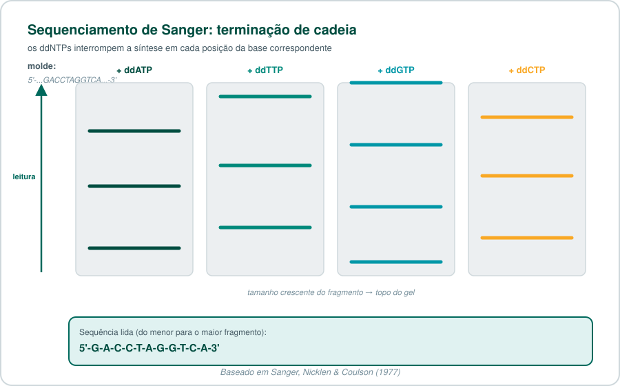
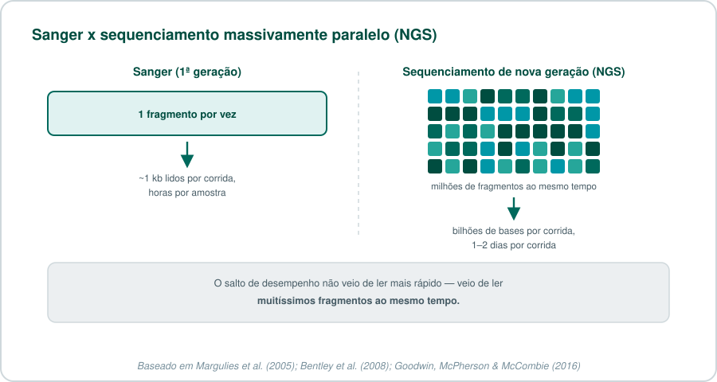
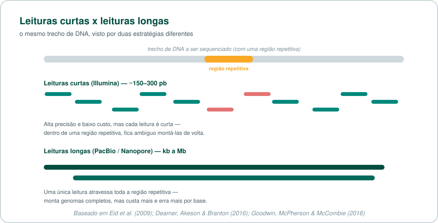
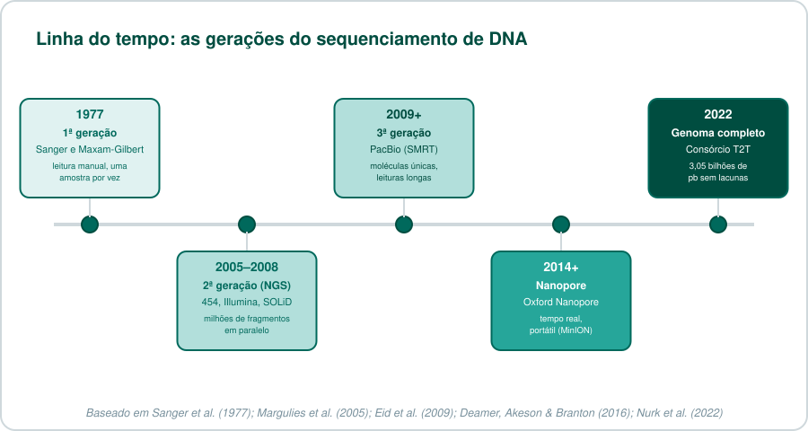
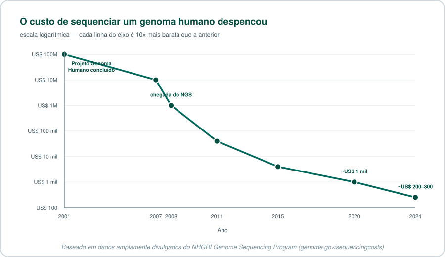

---
tags:
  - Postagem
  - Sequenciamento
  - Sanger
  - NGS
  - PacBio
  - Nanopore
  - Genômica
---

# 🧬 Sequenciamento de DNA: da descoberta às tecnologias modernas

> **Como aprendemos a ler a molécula que carrega a informação da vida — e por que essa leitura ficou 500 mil vezes mais barata em duas décadas.**

!!! tip "Para quem tem pressa"
    Sequenciar DNA significa descobrir a ordem exata das bases (A, T, C, G) em uma molécula. A primeira forma prática de fazer isso, em 1977, lia um fragmento por vez e levava dias. Hoje, uma única corrida sequencia bilhões de fragmentos ao mesmo tempo (**NGS**, 2ª geração) ou lê moléculas inteiras, de ponta a ponta, em tempo real (**3ª geração**, PacBio e Nanopore). O resultado: o genoma humano, que custou ~2,7 bilhões de dólares para ser sequenciado, hoje pode ser sequenciado por algumas centenas de dólares.

## Sumário

1. [Por que sequenciar DNA é difícil?](#por-que-sequenciar-dna-e-dificil)
2. [O nascimento do sequenciamento (1977)](#o-nascimento-do-sequenciamento-1977)
3. [Da bancada à escala industrial](#da-bancada-a-escala-industrial)
4. [A revolução do NGS (2ª geração)](#a-revolucao-do-ngs-2a-geracao)
5. [Terceira geração: leituras longas](#terceira-geracao-leituras-longas)
6. [Sequenciamento hoje: para onde isso foi](#sequenciamento-hoje-para-onde-isso-foi)
7. [A linha do tempo completa](#a-linha-do-tempo-completa)
8. [O custo despencou](#o-custo-despencou)
9. [Próximos posts desta série](#proximos-posts-desta-serie)
10. [Teste seus conhecimentos](#teste-seus-conhecimentos)
11. [Referências](#referencias)

---

## Por que sequenciar DNA é difícil?

O DNA é uma molécula longa e repetitiva: apenas quatro "letras" químicas (adenina, timina, citosina e guanina) se repetem bilhões de vezes, sem nada que marque visualmente onde uma informação começa ou termina. Determinar a **ordem exata** dessas letras — o sequenciamento — é o que transforma essa molécula de um emaranhado químico em um texto legível: genes, regiões regulatórias, variantes associadas a doenças.

O problema é de escala: o genoma humano tem cerca de 3,1 bilhões de pares de bases. Nenhum método de laboratório lê uma molécula inteira de uma vez — todas as tecnologias que você vai ver aqui são, no fundo, formas diferentes de resolver esse mesmo obstáculo.

---

## O nascimento do sequenciamento (1977)

Em 1977, dois grupos publicaram, quase ao mesmo tempo, os dois primeiros métodos práticos para sequenciar DNA.

**Frederick Sanger, Sandra Nicklen e Alan Coulson** desenvolveram o método de **terminação de cadeia**: uma DNA polimerase copia o molde na presença de didesoxinucleotídeos (ddNTPs) — versões modificadas das bases normais que, uma vez incorporadas, impedem a cadeia de continuar crescendo. O resultado é uma mistura de fragmentos de todos os tamanhos possíveis, cada um terminando exatamente na posição de uma base específica. Separando esses fragmentos por tamanho (por eletroforese em gel), dá para "ler" a sequência, fragmento por fragmento[^1].

Quase simultaneamente, **Allan Maxam e Walter Gilbert** publicaram um método diferente, de **degradação química**: em vez de sintetizar novas cadeias, ele quebra quimicamente uma cadeia já existente em pontos específicos de cada tipo de base[^2]. O método de Maxam-Gilbert foi importante e amplamente usado no início, mas exigia reagentes mais perigosos (incluindo hidrazina) e não se prestava bem à automação — por isso, ao longo da década de 1980, o método de Sanger se tornou dominante.

!!! info "Um Nobel para o método"
    Frederick Sanger recebeu seu **segundo** Prêmio Nobel de Química em 1980 (o primeiro foi em 1958, pelo sequenciamento de proteínas) — dividido com Walter Gilbert, pelo desenvolvimento dos métodos de sequenciamento de DNA, e com Paul Berg, por seu trabalho em DNA recombinante. Até hoje, apenas Sanger e mais três pessoas ganharam dois Prêmios Nobel individuais.

---

## Da bancada à escala industrial

O método de Sanger manual era lento e trabalhoso — cada corrida lia poucas centenas de bases. Duas inovações o transformaram em uma ferramenta industrial:

- **Fluorescência em vez de radioatividade**: cada ddNTP passou a carregar um corante fluorescente de cor diferente, permitindo detectar as quatro bases numa única corrida (em vez de quatro géis separados).
- **Eletroforese capilar automatizada**: tubos capilares finíssimos substituíram os géis de placa, e máquinas passaram a ler e registrar os resultados automaticamente, sem intervenção manual constante.

Essas duas mudanças tornaram viável o **Projeto Genoma Humano** (1990–2003): um consórcio internacional sequenciou, pela primeira vez, o genoma humano completo, ao custo estimado de aproximadamente 2,7 bilhões de dólares e treze anos de trabalho[^3].

??? question "O Projeto Genoma Humano usou a mesma tecnologia até o fim?"
    Sim — o rascunho publicado em 2001 e a versão "completa" de 2003 foram produzidos com sequenciamento de Sanger automatizado, a mesma tecnologia desde a década de 1980, só que em escala industrial (centenas de máquinas rodando em paralelo em múltiplos centros ao redor do mundo). O sequenciamento de nova geração, que você vai ver a seguir, só chegaria ao mercado alguns anos depois — e é responsável pela queda de custo que veio na sequência.

---

## A revolução do NGS (2ª geração)

O Projeto Genoma Humano mostrou que sequenciar um genoma humano era possível — mas, a esse custo e nesse prazo, longe de ser prático para uso rotineiro em pesquisa ou clínica. A resposta da indústria, a partir de meados dos anos 2000, foi abandonar a ideia de ler um fragmento de cada vez e passar a ler **milhões de fragmentos simultaneamente**: o sequenciamento de nova geração (*next-generation sequencing*, NGS), também chamado de segunda geração.

A primeira plataforma comercial de sucesso foi o **454** (Roche, 2005), baseado em pirosequenciamento — detecção de luz emitida a cada base incorporada[^4]. Ele foi rapidamente superado, em volume de mercado, pela tecnologia da **Illumina** (2006, originalmente Solexa): sequenciamento por síntese com terminadores reversíveis, que hoje domina a maior parte do mercado de sequenciamento do mundo[^5].

??? info "Glossário rápido: plataformas de NGS"
    - **454 (Roche)**: pirosequenciamento — detecta pirofosfato liberado a cada base incorporada. Descontinuado em 2016.
    - **Illumina (Solexa)**: sequenciamento por síntese com terminadores reversíveis fluorescentes; hoje a plataforma de NGS mais usada no mundo.
    - **SOLiD (Life Technologies)**: sequenciamento por ligação, em vez de síntese; também descontinuado.
    - **Ion Torrent**: detecta a variação de pH causada pela liberação de um íon H⁺ a cada base incorporada — sem necessidade de câmeras ou fluorescência.

O ganho não veio de ler mais rápido por fragmento — veio de processar uma quantidade descomunal de fragmentos ao mesmo tempo, trocando "poucos fragmentos, muito longos" por "muitíssimos fragmentos, curtos".

!!! tip "Quer entender a química da Illumina passo a passo?"
    Isso será tema de um post futuro desta série — **Sequenciamento Illumina na Prática** — cobrindo bridge amplification, terminadores reversíveis e como interpretar o FASTQ resultante.

---

## Terceira geração: leituras longas

O NGS tem uma limitação inerente: seus fragmentos são curtos (tipicamente 150–300 pares de bases). Isso é suficiente para muitas aplicações, mas cria ambiguidade em regiões repetitivas do genoma — se um fragmento curto poderia ter vindo de várias posições diferentes do genoma, a montagem da sequência completa fica incerta.

A **terceira geração** de sequenciamento resolve isso lendo moléculas de DNA muito mais longas — de milhares a milhões de bases — de uma vez, muitas vezes em tempo real e a partir de uma única molécula, sem etapas de amplificação por PCR:

- **PacBio (SMRT — Single Molecule, Real-Time)**: observa uma única molécula de DNA polimerase sintetizando uma nova fita em tempo real, dentro de um poço nanométrico (*zero-mode waveguide*) pequeno o bastante para isolar opticamente um único evento de incorporação de base[^6].
- **Oxford Nanopore**: passa uma fita de DNA (ou RNA) através de um poro proteico nanométrico embutido numa membrana; a passagem de cada base altera minimamente a corrente elétrica através do poro, e essa variação é decodificada em sequência por um algoritmo[^7].

!!! tip "Quer entender o SMRT e o nanoporo em detalhe?"
    Isso será tema de um post futuro desta série — **PacBio e Nanopore: Sequenciamento de Terceira Geração em Detalhe**.

---

## Sequenciamento hoje: para onde isso foi

O sequenciamento deixou de ser um projeto de bilhões de dólares e passou a ser uma ferramenta rotineira, usada de formas que seriam impensáveis nos anos 2000:

- **RNA-Seq**: em vez de sequenciar DNA genômico, sequenciamos RNA para medir quais genes estão ativos e em que quantidade. Publicamos um [tutorial completo de RNA-Seq](bioinfo/transcriptoma/rnaseq.md) usando essa mesma base tecnológica (Illumina/Salmon).
- **Sequenciamento de célula única**: em vez de uma amostra com milhões de células misturadas, sequenciamos célula por célula — revelando heterogeneidade que ficava escondida em uma média. Será tema de um post futuro desta série.
- **Metagenômica**: sequenciar todo o DNA de uma amostra ambiental ou clínica de uma vez, sem isolar organismos individuais primeiro — usado para estudar microbiomas inteiros.
- **Genomas verdadeiramente completos**: em 2022, o consórcio Telomere-to-Telomere (T2T) publicou a primeira sequência completa e sem lacunas de um genoma humano (3,055 bilhões de pares de bases), combinando leituras longas de PacBio HiFi e Oxford Nanopore — algo impossível apenas com leituras curtas, exatamente pela questão das regiões repetitivas que vimos acima[^8]. Já falamos sobre isso [no post sobre o Dogma Central](post1_dogma_central.md#o-desafio-dos-dados-biologicos).
- **Sequenciamento de campo, em tempo real**: dispositivos portáteis como o MinION (Oxford Nanopore) — do tamanho de um pendrive — já foram usados para rastrear surtos de Ebola na África Ocidental em tempo real e chegaram a ser testados a bordo da Estação Espacial Internacional.

---

## A linha do tempo completa

| Geração | Exemplos | Tamanho da leitura | Ponto forte | Ponto fraco |
|---|---|---|---|---|
| 1ª (Sanger) | Sanger, Maxam-Gilbert | ~500–1000 pb | Altíssima precisão | Um fragmento por vez, caro em escala |
| 2ª (NGS) | Illumina, 454, SOLiD, Ion Torrent | ~50–300 pb | Baixíssimo custo por base, altíssimo volume | Leituras curtas, difícil em regiões repetitivas |
| 3ª (leituras longas) | PacBio, Oxford Nanopore | kb a Mb | Atravessa regiões repetitivas, tempo real, portátil | Maior taxa de erro por base (embora em queda constante) |

---

## O custo despencou

Essa curva é um dos gráficos mais citados em genômica — e por um motivo específico: entre 2007 e 2011, o custo caiu **mais rápido do que a Lei de Moore prevê para a computação**, justamente no período em que o NGS substituiu o Sanger automatizado em escala industrial[^9].

---

## Próximos posts desta série

Este post ficou como uma visão geral — cada tecnologia mencionada aqui merece um mergulho próprio. Os próximos posts desta série vão cobrir:

- **Sequenciamento Illumina na Prática** — a química de sequenciamento por síntese, passo a passo.
- **PacBio e Nanopore: Sequenciamento de Terceira Geração em Detalhe** — como o SMRT e o nanoporo realmente funcionam.
- **Sequenciamento de Célula Única (Single-Cell)** — por que sequenciar célula por célula muda o que conseguimos enxergar.

---

## Teste seus conhecimentos

??? question "1. Por que o método de Maxam-Gilbert perdeu espaço para o de Sanger?"
    Porque dependia de reagentes químicos mais perigosos (incluindo hidrazina) e se prestava pior à automação. O método de Sanger, por ser baseado em síntese enzimática, foi mais fácil de automatizar com fluorescência e eletroforese capilar — o que acabou sendo decisivo para escalar.

??? question "2. O que realmente mudou entre o sequenciamento de Sanger automatizado e o NGS?"
    Não foi a velocidade de leitura de um único fragmento — foi a capacidade de ler milhões de fragmentos ao mesmo tempo (sequenciamento massivamente paralelo), em vez de um de cada vez.

??? question "3. Por que leituras curtas (Illumina) têm dificuldade com regiões repetitivas do genoma?"
    Porque, se um fragmento curto é idêntico a sequências que aparecem em várias posições diferentes do genoma, não há como saber com certeza de qual posição ele realmente veio — a montagem da sequência final fica ambígua nesse trecho.

??? question "4. Como o sequenciamento de terceira geração resolve esse problema das regiões repetitivas?"
    Lendo moléculas de DNA muito mais longas (milhares a milhões de bases) de uma só vez — uma leitura longa o suficiente pode atravessar toda uma região repetitiva de ponta a ponta, eliminando a ambiguidade que leituras curtas teriam ali.

??? question "5. O genoma humano 'completo' de 2003 e o genoma 'completo' do consórcio T2T em 2022 são a mesma coisa?"
    Não exatamente — a versão de 2003 ainda tinha lacunas em regiões repetitivas difíceis de montar com a tecnologia da época (Sanger). Só em 2022, combinando leituras longas de PacBio HiFi e Oxford Nanopore, o consórcio T2T conseguiu preencher essas lacunas e publicar a primeira sequência realmente completa, sem nenhuma lacuna, de um genoma humano.

---

## Referências

[^1]: Sanger F, Nicklen S, Coulson AR. DNA sequencing with chain-terminating inhibitors. *Proceedings of the National Academy of Sciences USA*. 1977;74(12):5463–5467. doi: [10.1073/pnas.74.12.5463](https://doi.org/10.1073/pnas.74.12.5463).

[^2]: Maxam AM, Gilbert W. A new method for sequencing DNA. *Proceedings of the National Academy of Sciences USA*. 1977;74(2):560–564. doi: [10.1073/pnas.74.2.560](https://doi.org/10.1073/pnas.74.2.560).

[^3]: International Human Genome Sequencing Consortium. Initial sequencing and analysis of the human genome. *Nature*. 2001;409(6822):860–921. doi: [10.1038/35057062](https://doi.org/10.1038/35057062).

[^4]: Margulies M, Egholm M, Altman WE, et al. Genome sequencing in microfabricated high-density picolitre reactors. *Nature*. 2005;437(7057):376–380. doi: [10.1038/nature03959](https://doi.org/10.1038/nature03959).

[^5]: Bentley DR, Balasubramanian S, Swerdlow HP, et al. Accurate whole human genome sequencing using reversible terminator chemistry. *Nature*. 2008;456(7218):53–59. doi: [10.1038/nature07517](https://doi.org/10.1038/nature07517).

[^6]: Eid J, Fehr A, Gray J, et al. Real-time DNA sequencing from single polymerase molecules. *Science*. 2009;323(5910):133–138. doi: [10.1126/science.1162986](https://doi.org/10.1126/science.1162986).

[^7]: Deamer D, Akeson M, Branton D. Three decades of nanopore sequencing. *Nature Biotechnology*. 2016;34(5):518–524. doi: [10.1038/nbt.3423](https://doi.org/10.1038/nbt.3423).

[^8]: Nurk S, Koren S, Rhie A, et al. The complete sequence of a human genome. *Science*. 2022;376(6588):44–53. doi: [10.1126/science.abj6987](https://doi.org/10.1126/science.abj6987).

[^9]: Goodwin S, McPherson JD, McCombie WR. Coming of age: ten years of next-generation sequencing technologies. *Nature Reviews Genetics*. 2016;17(6):333–351. doi: [10.1038/nrg.2016.49](https://doi.org/10.1038/nrg.2016.49). Dados de custo: Wetterstrand KA. DNA Sequencing Costs: Data from the NHGRI Genome Sequencing Program (GSP). National Human Genome Research Institute. Disponível em: [genome.gov/sequencingcosts](https://www.genome.gov/about-genomics/fact-sheets/Sequencing-Human-Genome-cost).
